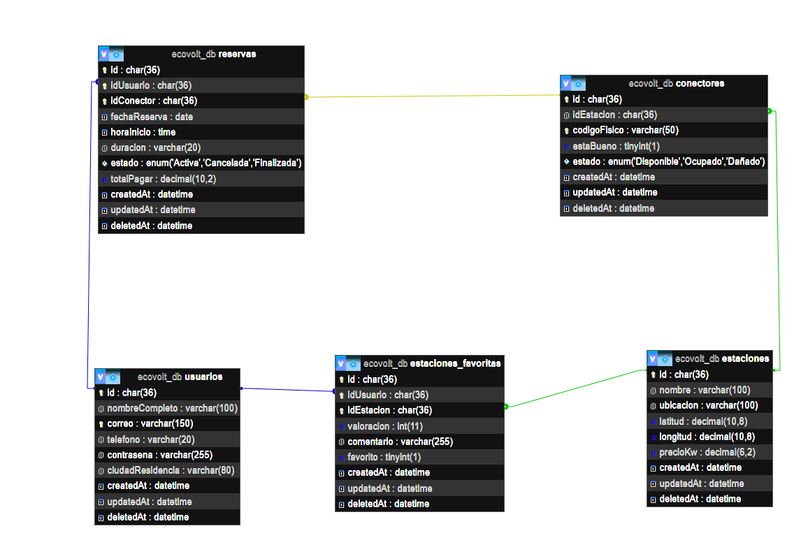
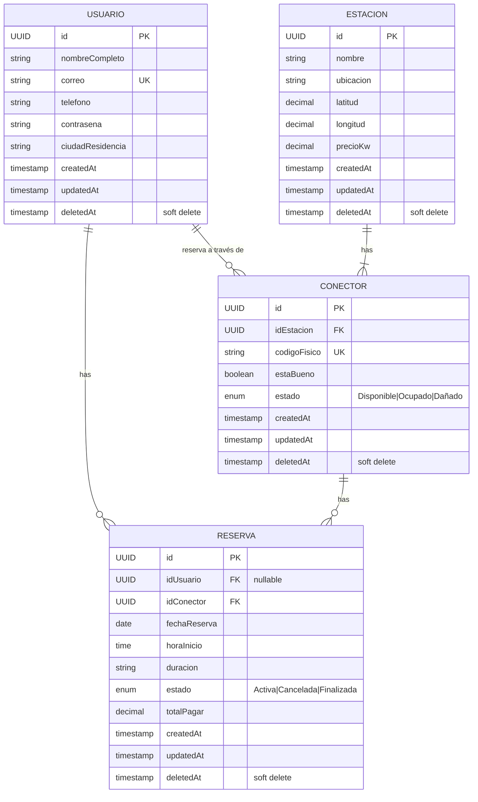

## Retos Técnicos 

### 1. Soft Delete y Integridad Referencial

**¿Qué pasa cuando un usuario elimina su cuenta?**

Se implementó **Soft Delete** (`paranoid: true`) en el modelo Usuario.  
Cuando un usuario elimina su cuenta, **sus reservas no se eliminan**. Se configuró `onDelete: 'SET NULL'` para que el `idUsuario` se ponga en `NULL`, manteniendo el historial completo de reservas y consumos.

Esto permite conservar información valiosa para los dueños de las estaciones y auditorías del sistema.

### 2. Relación Muchos a Muchos (Usuario - Conector)

Un usuario puede reservar **muchos conectores**, y un conector puede ser reservado por **muchos usuarios**.  

La tabla **`Reserva`** funciona como entidad asociativa con atributos propios:
- `fechaReserva`
- `horaInicio`
- `estado`
- `totalPagar`
- `idConector`

Se establecieron correctamente las relaciones: `Usuario` ↔ `Reserva` ↔ `Conector`.

Además, se agregó una segunda tabla intermedia con lógica de negocio:
- `EstacionFavorita` / `estaciones_favoritas` modela la relación N:M entre usuarios y estaciones.
- Esta tabla permite representar estaciones favoritas, valoraciones y comentarios por usuario sin mezclarla con la lógica de reservas.

### 2.1 Revisión de tablas intermedias

- Existe una relación **N:M** entre `usuarios` y `conectores`.
- La tabla **`reservas`** ya actúa como la **tabla intermedia** requerida.
- `reservas` contiene las claves foráneas `idUsuario` y `idConector` y además atributos propios de la reserva.
- No hay tablas flotando: todas las entidades están relacionadas.
- Por tanto, el modelo **cumple el punto 3** de tablas intermedias.

### 3. Validaciones de Negocio

Se implementaron validaciones rigurosas en el modelo `Estacion`:

- **Precio por kWh**: No puede ser negativo ni cero (rango: 0.01 - 500.00)
- **Coordenadas geográficas**:
  - Latitud entre **-4.0** y **13.0**
  - Longitud entre **-79.0** y **-66.0**

Estas validaciones garantizan que los datos sean realistas y consistentes con la geografía de Colombia.

---

# Correcciones Realizadas - Proyecto Estaciones de Carga

## Correcciones según observaciones

Se han corregido los **4 errores** identificados :

---

### 1. Soft Delete y SET NULL (Usuario)

**Problema:** `onDelete: 'SET NULL'` no funciona con `paranoid: true`.  
**Corrección aplicada:**
- Se implementó un hook `afterDestroy` en el modelo `Usuario`.
- Al realizar soft delete de un usuario, sus reservas se actualizan automáticamente:
  - `idUsuario` → `NULL`
  - `estado` → `'Cancelada'`

---

###  2. Redundancia Lógica en el modelo Reserva

**Problema:** Se guardaba tanto `idEstacion` como `idConector` en las reservas.  
**Corrección aplicada:**
- Se eliminó completamente el campo `idEstacion` del modelo `Reserva`.
- Ahora solo se referencia `idConector` (correcto y normalizado).

---

###  3. Relación faltante entre Estación y Conector

**Problema:** No estaba definida la relación principal `Estacion ↔ Conector`.  
**Corrección aplicada:**
- Se agregaron correctamente las asociaciones en `models/index.js`:
  ```js
  Estacion.hasMany(Conector, { foreignKey: 'idEstacion', as: 'conectores' });
  Conector.belongsTo(Estacion, { foreignKey: 'idEstacion', as: 'estacion' });

---

## Justificación de los `onDelete` en las asociaciones

Se listan a continuación las asociaciones principales y la razón por la cual se eligió cada estrategia de borrado (`onDelete`). Además se indica cómo se compatibiliza esto con `paranoid: true` (soft delete).

- **`Estacion.hasMany(Conector)` — `onDelete: 'CASCADE'`**
  - Motivo: un `Conector` depende obligatoriamente de una `Estacion` (`idEstacion` NOT NULL). Si una estación se elimina, sus conectores carecen de sentido funcional y deben eliminarse también.
  - Implementación: además del `onDelete: 'CASCADE'` a nivel de FK, el modelo `Estacion` contiene hooks (`beforeDestroy`, `beforeBulkDestroy`) que propagan el borrado suave a los conectores para mantener coherencia cuando se usa `paranoid: true`.

- **`Conector.hasMany(Reserva)` — `onDelete: 'CASCADE'`**
  - Motivo: `Reserva.idConector` es NOT NULL y una reserva sin conector no es válida. Por eso se usa `CASCADE` para eliminar (o marcar) reservas al borrar un conector.
  - Implementación: el modelo `Conector` tiene hooks (`beforeDestroy`, `beforeBulkDestroy`) que realizan la eliminación suave de las reservas relacionadas cuando se usa `paranoid: true`.

- **`Usuario.hasMany(Reserva)` — `onDelete: 'SET NULL'`**
  - Motivo: queremos conservar el historial de reservas para auditoría, facturación y estadísticas aun si el usuario se elimina. Por eso al borrar un usuario se pone `idUsuario = NULL` en las reservas en lugar de borrarlas.
  - Implementación: dado que `paranoid: true` impide que la eliminación sea física y las reglas de FK a nivel de BD no siempre se apliquen, se añadió un hook `afterDestroy` en `Usuario` que actualiza las reservas relacionadas poniendo `idUsuario = NULL` y opcionalmente marcando el `estado` como `'Cancelada'`.

- **`Usuario ↔ Conector (N:M through Reserva)` — `onDelete: 'RESTRICT'`**
  - Motivo: la relación N:M utiliza `Reserva` como tabla intermedia con datos importantes. `RESTRICT` evita eliminar usuarios o conectores de forma que se pierda el historial sin manejo explícito.
  - Implementación: la restricción a nivel de FK protege la integridad; para borrados suaves se confía en los hooks descritos arriba para manejar las referencias antes de una eliminación lógica.

---

## Diagrama de Entidades y Relaciones (ER)



### Descripción de las relaciones:

| Origen | Destino | Tipo | onDelete | Descripción |
|--------|---------|------|----------|-------------|
| **Estacion** | **Conector** | 1:N | CASCADE | Una estación tiene muchos conectores. Si la estación se elimina, sus conectores se eliminan en cascada. |
| **Conector** | **Reserva** | 1:N | CASCADE | Un conector tiene muchas reservas. Si el conector se elimina, sus reservas se eliminan en cascada. |
| **Usuario** | **Reserva** | 1:N | SET NULL | Un usuario tiene muchas reservas. Si el usuario se elimina (soft delete), sus reservas se mantienen pero `idUsuario` se pone en NULL. |
| **Usuario** ↔ **Conector** | **Reserva** | N:M | RESTRICT | Un usuario puede reservar muchos conectores y un conector puede ser reservado por muchos usuarios. La tabla `Reserva` es la tabla intermedia con atributos propios. |

### Características de las tablas:

- **Todas usan `paranoid: true`**: Implementan soft delete mediante `deletedAt`.
- **Todas tienen `timestamps: true`**: Incluyen `createdAt` y `updatedAt` automáticamente.
- **Todas usan UUID como PK**: Para escalabilidad y distribución.
- **Validaciones**: Estacion tiene validaciones de coordenadas y precio; Usuario tiene validación de email.

### Conclusión del modelo

- El modelo está normalizado y no contiene tablas flotantes.
- `reservas` cumple la función de tabla intermedia para la relación N:M entre `usuarios` y `conectores`.
- Se agregó la tabla intermedia `EstacionFavorita` (`estaciones_favoritas`) para modelar la relación N:M entre `usuarios` y `estaciones`.
- No se requieren tablas intermedias adicionales más allá de `reservas` y `EstacionFavorita`.
- Las claves foráneas están correctamente ubicadas en las tablas hijas: `conectores.idEstacion`, `reservas.idConector`, `reservas.idUsuario`, `estaciones_favoritas.idUsuario` y `estaciones_favoritas.idEstacion`.
- El modelo cumple el requisito de realizar todas las tablas intermedias necesarias para este dominio.


